# Handoff Doc 
*erica@ericadreisbach.com - December 2025*

- 2/15 as of 15 Dec 2025 

# Contents 

**Active Projects**
- [Acelpa](#acelpa) (see also [CSPRx](#csprx)) 
- [Bernie's Book Bank](#bernies)
- [Carow Packaging](#carow)
- [CSPRx](#csprx)
- [DeliverHealth](#deliverhealth)
- [EnviroServe](#enviroserve)
- [Flexsys](#flexsys)
- [JO fka Japs-Olson](#japs-olson)
- [Kensing Solutions](#kensing)
- [Permatron](#permatron)
- [Robertshaw](#robertshaw)
- [Schebler Spec Fab](#scheblerspecfab)

**Legacy Projects**
- [ArchKey Solutions](#archkey)
- [Palatine Community Baseball and Softball](#pcbs)
- [PharmaLogistics](#pharmalogistics)
- [RTMec](#rtmec)
- [TIGRIS](#tigris)

# Active Projects

# Acelpa 

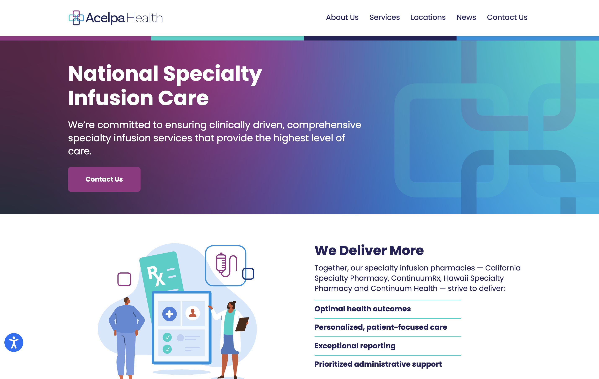

**URL:** https://acelpahealth.com/

**Development URL:** https://acelpahealtdev.wpenginepowered.com/

**History + Status:** Enfold child theme build, initiated by contractor Manny Quintanilla and completed by erica dreisbach. Launched June 2025. Running well, working well. 

**Hosting:** WP Engine https://my.wpengine.com/installs/acelpahealth

**DNS:** GoDaddy - Client has access

**Analytics**
- <a href="https://tagmanager.google.com/#/container/accounts/6293029069/containers/218873956/workspaces/4" target="_blank" rel="noopener">Google Analytics</a>
- <a href="https://search.google.com/search-console?resource_id=https%3A%2F%2Facelpahealth.com%2F" target="_blank" rel="noopener">Google Search Console</a>
- <a href="https://tagmanager.google.com/#/container/accounts/6293029069/containers/218873956/workspaces/4" target="_blank" rel="noopener">Google Tag Manager</a>

**Contacts** 
- Client: Brittany Lett Brittany.Lett@csprx.com
- PG Accounts: Eliza Uhland eliza@peppergroup.com
- PG Tech Lead: erica dreisbach erica@peppergroup.com 
- PG Tech Backup: Joe Whittington joseph@peppergroup.com 
- PG Design Lead: Joe Whittington joseph@peppergroup.com 

**Internal Project Assets**
- Egnyte https://peppergroup.egnyte.com/fl/RXVHdDy3y9Gd 
- Figma https://www.figma.com/design/wwtY3kDb0jInNpNJzV9vu1/Acelpa?node-id=0-1&t=bcXS3kz7caguoekj-1
- Asana https://app.asana.com/1/1166973237627545/project/1209526330039511/list/1209526341256999

**Repositories** 
- Production `git@git.wpengine.com:acelpahealth.git`
- Development `git@git.wpengine.com:acelpahealth.git`
- Github `git@github.com:PepperGroup/acelpa.git`

**Tech Stack Notes** 
- Site forms built with HubSpot 
- Site uses the Web Accessibility by accessiBe plugin 
- Locations page uses Storepoint map https://acelpahealth.com/locations/   Storepoint account for this client is under websites@peppergroup.com; associated Google Cloud API key for Google Maps linked to pepperanalytics@gmail.com and Google Cloud billing using VISA ending 3406 under **Acelpa Locations - Storepoint** - <a href="https://console.cloud.google.com/billing/0130DA-20A96C-25B84C?project=storepoint-proof-of-concept" target="_blank" rel="noopener">Google Cloud Billing</a> 
    - Map views historically are well under the 10,000 maploads per month that would trigger billing 

**Recurring Tasks**
- Monthly Storepoint receipts comes to websites@peppergroup.com for charges related to the Locations page (map feature) https://acelpahealth.com/locations/  Receipts should be forwarded to lynn@peppergroup.com and cc'ed to eliza@peppergroup.com with the note: 
> See attached for Acelpa, job CSP-5118 (Acelpa/CSPRx)
https://app.asana.com/1/1166973237627545/project/1166973102232817/task/1211024002678991?focus=true

**Known Issues / Tech Debt**
- Optional-but-recommended schema fields missing from blog posts:  
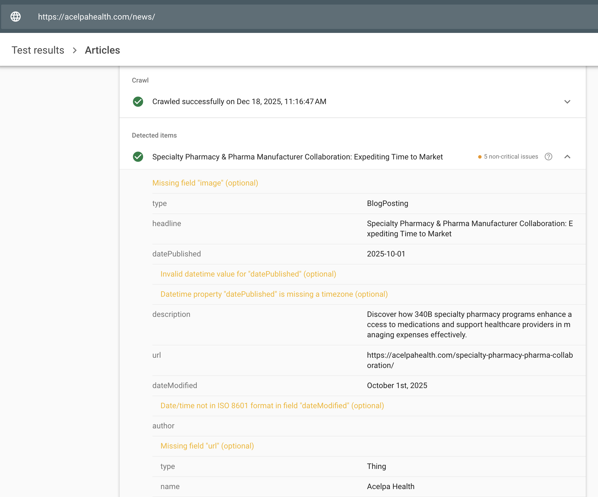

**Quirks + Important Context** 
- Footer Privacy Policy links are outbound links to PDFs hosted on HubSpot
- Acelpa is part of a wider pharmacy acquisition network, similar to PG's private equity clients. The acelpahealth.com site was an exception for this client, in that PG created a site from the ground up rather than integrate brand style onto an existing site (as with https://hisprx.com). 

# Bernie's Book Bank

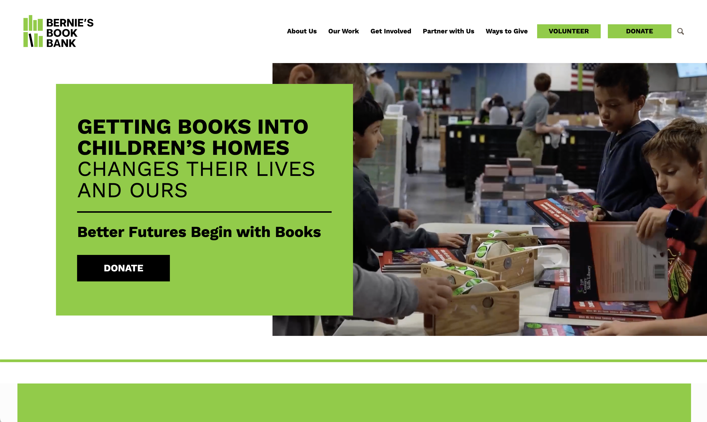

**URL:** https://www.berniesbookbank.org/ 

**Staging URL:** https://berniesbookstg.wpenginepowered.com/ 

**Archive Legacy URL:** https://berniesbooks.wpenginepowered.com/ 
un: demo 
pw: bernies

**History + Status:** Enfold child theme build by erica dreisbach launched August 2025. Running well with ongoing content updates by client's team. Receives monthly site maintenance from Pepper Group. 

**Hosting:** WP Engine https://my.wpengine.com/installs/berniesbookbnk

**DNS:** Cloudflare - Client IT has access

**Analytics**
- <a href="https://analytics.google.com/analytics/web/#/a354624040p488535554/reports/dashboard?params=_u..nav%3Dmaui%26_u..comparisons%3D%5B%7B%22savedComparisonId%22:%227512949286%22,%22name%22:%22All%20Users%22,%22isEnabled%22:true,%22filters%22:%5B%5D,%22systemDefinedSavedComparisonType%22:8,%22isSystemDefined%22:true%7D,%7B%22savedComparisonId%22:%227512949279%22,%22name%22:%22Direct%20traffic%22,%22isEnabled%22:true,%22filters%22:%5B%7B%22fieldName%22:%22sessionDefaultChannelGrouping%22,%22expressionList%22:%5B%22Direct%22%5D,%22isCaseSensitive%22:true%7D%5D,%22systemDefinedSavedComparisonType%22:1,%22isSystemDefined%22:true%7D,%7B%22savedComparisonId%22:%227512949280%22,%22name%22:%22Organic%20traffic%22,%22isEnabled%22:true,%22filters%22:%5B%7B%22fieldName%22:%22sessionDefaultChannelGrouping%22,%22evaluationType%22:8,%22expressionList%22:%5B%22Organic%20Search%22,%22Organic%20Video%22,%22Organic%20Social%22,%22Organic%20Shopping%22%5D,%22isCaseSensitive%22:true%7D%5D,%22systemDefinedSavedComparisonType%22:2,%22isSystemDefined%22:true%7D,%7B%22savedComparisonId%22:%227512949282%22,%22name%22:%22Referral%20%2526%20affiliates%20traffic%22,%22isEnabled%22:true,%22filters%22:%5B%7B%22fieldName%22:%22sessionDefaultChannelGrouping%22,%22evaluationType%22:8,%22expressionList%22:%5B%22Referral%22,%22Affiliates%22%5D,%22isCaseSensitive%22:true%7D%5D,%22systemDefinedSavedComparisonType%22:4,%22isSystemDefined%22:true%7D%5D%26_u.dateOption%3Dlast28Days%26_u.comparisonOption%3Ddisabled&ruid=lifecycle-engagement-overview,life-cycle,engagement&collectionId=12121653004&r=lifecycle-engagement-overview" target="_blank" rel="noopener">Google Analytics - BBB GA4</a>
- <a href="https://search.google.com/search-console?resource_id=https%3A%2F%2Fwww.berniesbookbank.org%2F" target="_blank" rel="noopener">Google Search Console</a>
- <a href="https://tagmanager.google.com/#/container/accounts/6294282128/containers/219566128/workspaces/4" target="_blank" rel="noopener">Google Tag Manager</a>

**Contacts**
- Client: Megan Leahy mleahy@berniesbookbank.org 
- Client IT: Tommy Lacher tlacher@berniesbookbank.org 
- PG Accounts: Grace Rodi grace@peppergroup.com 
- PG Tech Lead: erica dreisbach erica@peppergroup.com

**Internal Project Assets**
- Egnyte https://peppergroup.egnyte.com/fl/jqtcm6QMDYTp
- Asana https://app.asana.com/1/1166973237627545/project/1209826780911485/list/1209826830971096

**Repositories**
- Production `git@git.wpengine.com:berniesbookbnk.git`
- Staging `git@git.wpengine.com:berniesbookstg.git`
- Github `git@github.com:PepperGroup/bernies.git`

**Tech Stack Notes** 
- Site build uses Schema markup in template files to optimize search surfacing Events and Blog Posts
- A <u>wide</u> range of forms are used on the site: 
    - FormStack script embed  e.g. https://www.berniesbookbank.org/ (footer) 
    - FormStack iframe embeds  e.g. https://www.berniesbookbank.org/brand-partners/
    - Outbound links to FormStack forms  e.g. https://www.berniesbookbank.org/give-books/ "Start a Book Drive" > https://formstack.io/547E9 
    - Classy/GoFundMe donation embeds  e.g. https://www.berniesbookbank.org/donate/ 
    - Outbound links to Classy/GoFundMe pages  e.g. https://www.berniesbookbank.org/honorary-memorial-gifts/ "Digital Book Drive Fundraiser" > https://give.berniesbookbank.org/campaign/create-a-fundraising-page/c631618 
    - Embedded Cervis signup forms  e.g. https://www.berniesbookbank.org/individual-volunteering/ 
    - Outbound links to Cervis signup forms  e.g. https://www.berniesbookbank.org/volunteer/ "Volunteer as a Group" > https://berniesbookbank.cervistech.com/acts/console.php?console_id=0042&console_type=group 
    - Outbound links to Microsoft forms  e.g. https://www.berniesbookbank.org/give-books/ "Need a Receipt" > https://forms.office.com/pages/responsepage.aspx?id=Z7ESCVhNqUqo1KN5wRzJr-yxVFZeQNFMkKGbvWFJc4pUN1hXRkFYNjRSSDRaSkRURkhYSk1VQVFWUS4u 
- Build includes custom formatting buttons for the WordPress text editor (see `./assets/jas/tiny-mce.js`): 
    - Screen Reader Only Text
    - highlight (thin font used in header)
    - cite (for Testimonials speaker attribution) 
    - heading (`<h1>` styling as defined in this build)
    - subhead (`<h2>` styling as defined in this build)
    - subsubhead (`<h3>` styling as defined in this build)
    - button (style a link to look like a button)
- Uses a Storepoint embedded map connect to client's Google Cloud Account; Storepoint credentials in Keeper 
- Uses an &ldquo;Opt Out&rdquo; cookie notice powered by CookieYes
- Rotating image in desktop footer section editable from the WordPress back end under **Pre-Footer Images**; relevant code in `/inc/random-images.php`

**Recurring Tasks**
- Monthly WordPress site maintenance (plugin updates, tech stack checks, SEO checks)

**Known Issues / Tech Debt**
- FormStack iframe embeds include hard-coded max-height; if client adds or removes fields from within their FormStack interface, the form's max-height should be adjusted within the **Code** block  

- Client's Formstack default settings include placeholder spaces in the Firstname and Lastname fields, which can then become bad data in client's CRM as hard-coded spaces; form fields are currently cleared with JavaScript after the form loads, cf `./assets/jas/clear-formstack-names.js` 
- Internal anchor links to FAQ sections were prone to "not scroll to anchor." As a workaround, aggressive JavaScript waits for page load and ensures subsequent smooth scroll to FAQ sections: `./assets/forced-anchors.js` 
- Events requre manual updates in ACF for display 
- Schema for Events included only on Chapter pages due to the complexity of events with multiple locations and dates 
    - https://www.berniesbookbank.org/chicagoland/ 
    - https://www.berniesbookbank.org/greater-milwaukee/ 
    - https://www.berniesbookbank.org/florida-suncoast/ 
- Events schema logic should be updated to not appear if critical fields are not available (e.g. `location`, `startDate`) 
- Events schema implementation does not include optional-but-recommended fields:  
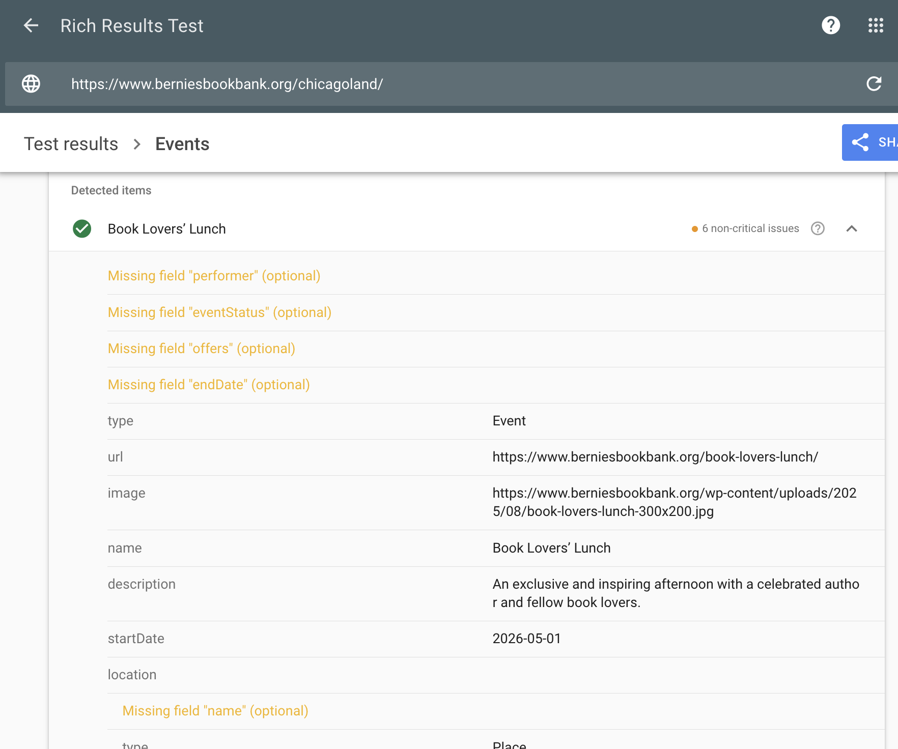 

**Quirks + Important Context** 
- Forms are under strict client control; during development, client allowed PG developer access via temporary credentials and screenshare as an acceptable workaround
- Confirmation action upon successful form submission varies widely; some forms redirect to https://www.berniesbookbank.org/thank-you, some forms open in a modal window that then closes, some forms display a modal thank you message, &c. 
- Site is on `www` subdomain; in the first months after development some users (including client) came to an error page when trying to access the site on the bare domain. In December 2025 client IT added a redirect in client DNS settings which resolved the observed DNS issue. 

## Carow Packaging 
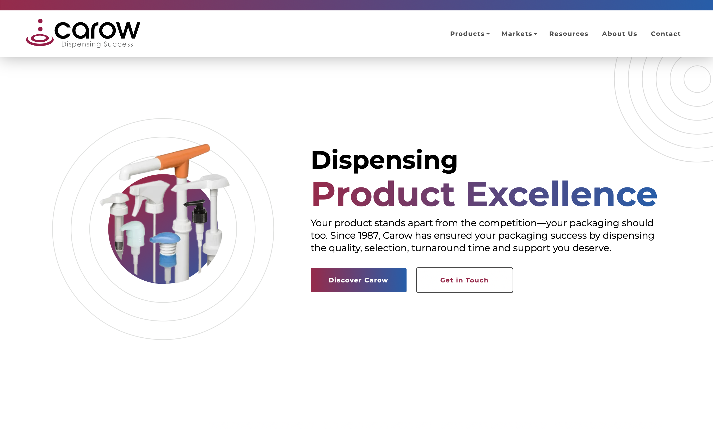

**URL:** https://carowpackaging.com/

**Development URL:** https://carowpackagstg.wpenginepowered.com/

**History + Status:** Site migrated from a HubSpot build to WordPress in September 2024. Enfold child theme build by erica dreisbach. 

**Hosting:** WP Engine https://my.wpengine.com/installs/carowpackaging

**DNS:** [??]

**Analytics**
- <a href="https://analytics.google.com/analytics/web/#/a267982792p375678185/reports/explorer?params=_u..nav%3Dmaui&ruid=875b9eda-240d-42e8-83e0-09b69fb38fd4&collectionId=10974198186&r=top-events" target="_blank" rel="noopener">Google Analytics</a> 
- <a href="https://tagmanager.google.com/#/container/accounts/6248145653/containers/194582045/workspaces/22" target="_blank" rel="noopener">Google Tag Manager</a>
- <a href="https://search.google.com/search-console?resource_id=https%3A%2F%2Fcarowpackaging.com%2F" target="_blank" rel="noopener">Google Search Console</a>

**Contacts**
- Client: Jenny DuPrey, Marketing Director jduprey@carowpackaging.com
- Client 3rd Party IT: Elena Bondarenko elena@paradigm-il.com
- Client 3rd Party CRM (Zoho): Manoj Manghnani manoj.manghnani@annexussolutions.com
- PG Accounts: Mahek Lakhani mahek@peppergroup.com
- PG Tech Lead: McCade Freeman mccade@peppergroup.com
- PG Tech Backup: erica dreisbach erica@peppergroup.com
- PG Design Lead: Joe Whittington joseph@peppergroup.com

**Internal Project Assets**
- Egnyte: https://peppergroup.egnyte.com/fl/B8GQTqPRkGRh/24-CAROW-4921_Website_ 
- Asana: https://app.asana.com/1/1166973237627545/project/1206780371875574/list/1206780373752256

**Repositories**
- Production: `git@git.wpengine.com:carowpackaging.git`
- Staging: `git@git.wpengine.com:carowpackagstg.git`
- Github: `git@github.com:PepperGroup/carow2024.git`

**Tech Stack Notes** 
- Uses Essential Grid for blog posts and products 
- Forms built with Gravity Forms
- Forms secured with Google reCAPTCHA v2 invisible https://www.google.com/recaptcha/admin/site/707930137

**Recurring Tasks**
- Monthly WordPress site maintenance (plugin updates, tech stack checks, SEO checks)

**Known Issues / Tech Debt**
- Resource sorting via Essential Grid is unfortunately limited to a blanket AND or OR Boolean logic, which makes for confusing UI https://carowpackaging.com/resources/ 
- At some browser heights, top frame cuts off Google reCAPTCHA badge in the lower right corner; screenshot below from Chrome on a retina Mac, 1692 pixels high:  
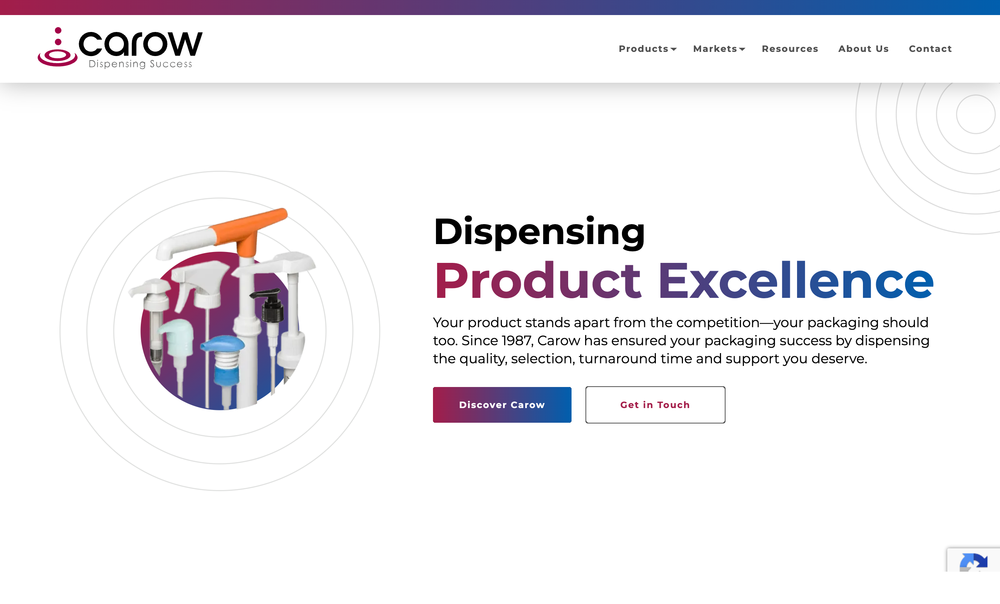

**Quirks + Important Context** 
- This particular Enfold child build has been particularly vulnerable to not generating CSS on-the-fly; frequently after monthly updates, homepage Products content does not wrap properly on desktop. CSS consistently properly regenerates upon saving the homepage from the Page Edit screen.

## CSPRx 

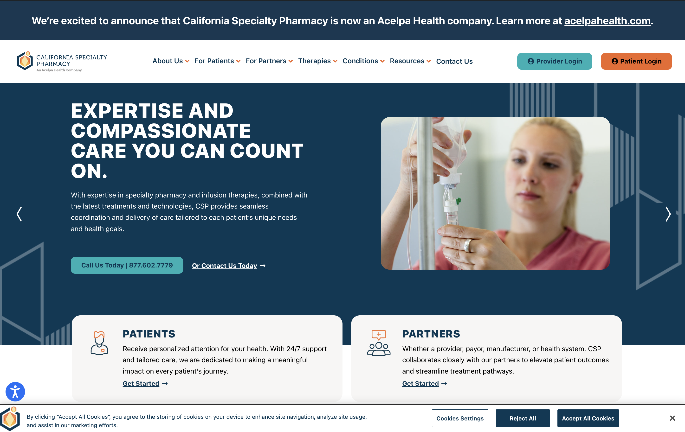

**URL:** https://csprx.com/ 

**Staging URL:** https://californiaspe2.wpenginepowered.com/

**Development URL:** http://californiasp3.wpenginepowered.com/

**History + Status:** Inherited build using Elementor and assorted Elementor add-ons. Significant PG development efforts toward improving accessibility and UI in 2025. 

**Hosting:** WP Engine https://my.wpengine.com/installs/californiaspe1

**DNS:** Client has access. 

**Analytics**
- <a href="https://tagmanager.google.com/#/container/accounts/6293029069/containers/218873956/workspaces/4 " target="_blank" rel="noopener">Google Tag Manager</a>
- <a href="https://analytics.google.com/analytics/web/#/a355728060p489866551/reports/intelligenthome?params=_u..nav%3Dmaui%26_u.dateOption%3DyearToDate&collectionId=user" target="_blank" rel="noopener">Google Analytics</a>
- <a href="https://search.google.com/search-console?resource_id=sc-domain%3Acsprx.com" target="_blank" rel="noopener">Google Search Console</a>

**Contacts**
- Client: Brittany Lett Brittany.Lett@csprx.com 
- PG Accounts: Eliza Uhland eliza@peppergroup.com 
- PG Tech Lead: McCade Freeman mccade@peppergroup.com 

**Internal Project Assets**
- Asana accessibility task - August 2025 - https://app.asana.com/1/1166973237627545/project/1166973102232817/task/1210978229802552?focus=true 
- Asana site improvement task - October 2025 https://app.asana.com/1/1166973237627545/project/1166973102232817/task/1211210078647171?focus=true 

**Repositories**
- Production git@git.wpengine.com:californiaspe1.git
- Development git@git.wpengine.com:californiasp3.git
- Github git@github.com:PepperGroup/csprx.git

**Tech Stack Notes** 
- Uses Elementor theme, Elementor Pro plugin, and The Plus Addons for Elementor
- Uses Gravity Forms 
- accessiBe widget added in the WordPress back end under **Custom CSS & JS > accessibe** with additional CSS customzation in `customify-child/header.php` 
- OneTrust cookie widget and additional CSS customization added in `customify-child/header.php` 

**Known Issues / Tech Debt**
- Site is a highly-customized inherited build

**Quirks + Important Context** 
- Client passes third-party tech reports (Screaming Frog report run by Taco, accessiBe accessibility reports) that serve as a punchlist for site updates from PG
- Site has a standalone Envoy portal airgapped from the WordPress build, used for sensitive individual patient and provider logins: https://portal.csprx.com/login/ 

## DeliverHealth 

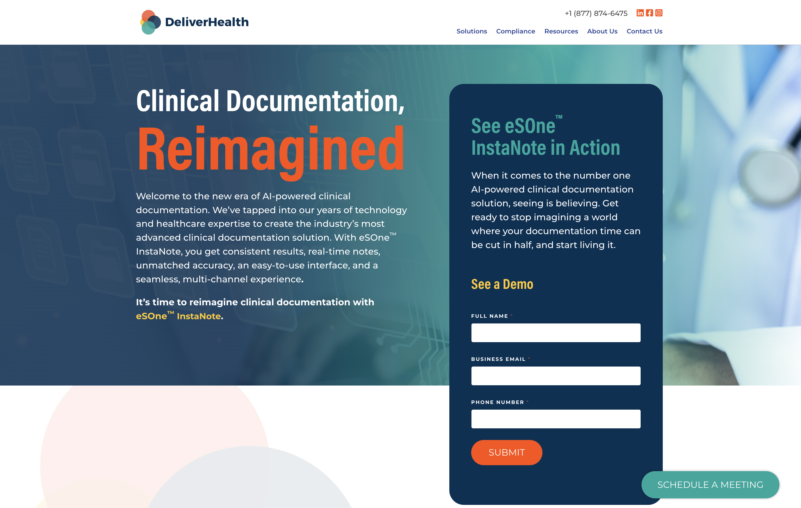

**Landing Page URL:** https://deliverhealth.com/esone-instanote/ 

**Main Site URL:** https://ai.deliverhealth.com/ 

**Legacy Site Staging URL:** https://staging-htech.deliverhealth.com/

**History + Status:** In July 2024 PG developed a handful of landing pages on client's WordPress site using Gravity Forms and Calendly. In November 2025 Client transitioned nearly all site content to an AI-generated build on Lovable under an `ai` subdomain, with the WordPress landing pages left standing on the bare domain. 

**Hosting:** Lovable site hosted on [??]; Legacy WordPress site hosted on SiteGround and managed by Hagadonetech 

**DNS:** Client has access 

**Analytics**
- <a href="https://analytics.google.com/analytics/web/#/a212024374p379520509/reports/intelligenthome?params=_u..nav%3Dmaui%26_u.dateOption%3DyearToDate&collectionId=user " target="_blank" rel="noopener">Google Analytics</a>
- <a href="https://search.google.com/search-console?resource_id=sc-domain%3Adeliverhealth.com" target="_blank" rel="noopener">Google Search Console</a>
- <a href="https://tagmanager.google.com/#/container/accounts/6004640110/containers/50232188/workspaces/39" target="_blank" rel="noopener">Google Tag Manager</a> 
- Google AdSense (SEO team has access)

**Contacts**
- Client: Andrea Schlosser andrea.schlosser@deliverhealth.com
- PG Accounts: Eliza Uhland eliza@peppergroup.com  
- PG Tech Lead: McCade Freman mccade@peppergroup.com
- Legacy Tech: Ben McGaughey at Hagonetech bmcgaughey@hagadonetech.com

**Internal Project Assets**
- Egnyte - WordPress Landing Pages https://peppergroup.egnyte.com/fl/BpfTPwT3ktJg/24-DeliverHealth-4910_Lead_Gen_Campaign_Setup%2C_Landing_Page_Development_and_Launch_
- Asana - WordPress Landing Pages https://app.asana.com/1/1166973237627545/task/1207817363353346?focus=true

**Repositories**
- Github `git@github.com:PepperGroup/deliverhealth.git`

**Tech Stack Notes** 
- WordPress landing pages use Calendly links
- WordPress forms built with WP Forms secured with reCAPTCHA v3 https://www.google.com/recaptcha/admin/site/729642121 
- WP Forms additionally secured with Antideo Email Validator, used in the build to bar disposible emails
- WP Forms notifications passed to client via Resend - client has access

**Recurring Tasks**
- N/A

**Known Issues / Tech Debt**
- N/A

**Quirks + Important Context** 
- If working on the Lovable site, beware applying AI-suggested security updates; Lovable's suggested and optional security updates have had unintended negative consequences throughout the build

## EnviroServe 

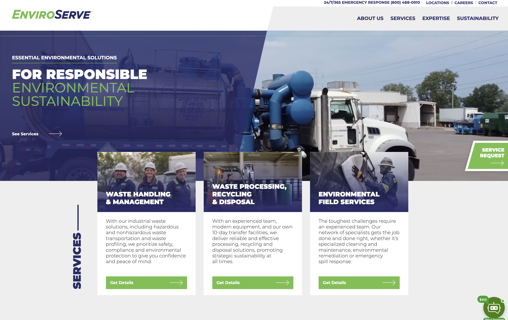

**URL:** https://enviroserve.com/ 

**Staging URL:** https://enviroserv1stg.wpenginepowered.com/ 

**Archive Legacy URL:** https://enviroservedev.wpenginepowered.com/  
un: enviroservedev 
pw: enviroservedev

**History + Status:** Site refresh launched August 2024 from an earlier PG-built WordPress site. Enfold child theme build by erica dreisbach.

**Hosting:** WP Engine https://my.wpengine.com/installs/enviroserve

**Analytics**
- Google Analytics https://analytics.google.com/analytics/web/#/a90456084p308273251/reports/intelligenthome?params=_u..nav%3Dmaui%26_u.dateOption%3DyearToDate&collectionId=user
- Google Tag Manager https://tagmanager.google.com/#/container/accounts/6000882334/containers/31020874/workspaces/41 **NOTE:** use &ldquo;EnviroServe&rdquo; Google Tag Manager container, not &ldquo;Enviroserve New&rdquo;
- Google Search Console https://search.google.com/search-console?resource_id=https%3A%2F%2Fenviroserve.com%2F

**Contacts**
- Client: [ ?? ]
- PG Accounts: Miranda Steczak miranda@peppergroup.com
- PG Tech Lead: erica dreisbach erica@peppergroup.com 
- PG Tech Backup: McCade Freeman mccade@peppergroup.com 
- PG Design Lead: co-designed by Brian Erickson brian@peppergroup.com and Joe Whittington joseph@peppergroup.com 

**Internal Project Assets**
- Egnyte https://peppergroup.egnyte.com/app/index.do#storage/files/1/Shared/Documents/Clients%20-%20Active/ENVIROSERVE/24-EnviroServe-4852_Website%20Development
- Asana https://app.asana.com/1/1166973237627545/project/1206302832312227/list/1206303617257602

**Repositories**
- Production `git@git.wpengine.com:enviroserve.git`
- Staging `git@git.wpengine.com:enviroserv1stg.git`
- Github `git@github.com:PepperGroup/enviroserve2024.git`

**Tech Stack Notes** 
- Uses the Ditty plugin for the &ldquo;stock ticker&rdquo; above the hero image
- Chatbot added via [ ?? ]

**Recurring Tasks**
- Monthly WordPress site maintenance (plugin updates, tech stack checks, SEO checks)

**Known Issues / Tech Debt**
- Services hotspot module should be updated to dismiss pop-ups with keyboard Escape key https://enviroserve.com/services/
- Modifications to Google Analytics were needed in order to properly trigger pageviews; Google Analytics Pageviews from the August 2024 launch through March 2025 are null. Build includes specialized JavaScript to manually ensure pageview event. 
    - Some web traffic information is recoverable from the WP Engine dashboard 
- Google Maps on Locations page connected to a non-PG Google account; unclear if this is client's Google account or a prior developer's. Map views as of December 2025 are well below the threshold that would trigger payment. 

**Quirks + Important Context** 
- EnviroServe sometimes hosts a fishing trip: 
    - https://enviroservedev.wpenginepowered.com/fishing-charter-registration-2024/ 
    - un: enviroservedev
    - pw: enviroservedev
- The legacy EnviroServe site automatically generated coordinates for new locations upon entering into the page editor. The redesigned site as of 2024 requires manual entry of location coordinates, which can be readily pulled from Google Maps. 
- Client uses a third-party service LocalIQ to improve engagement.

## Flexsys 

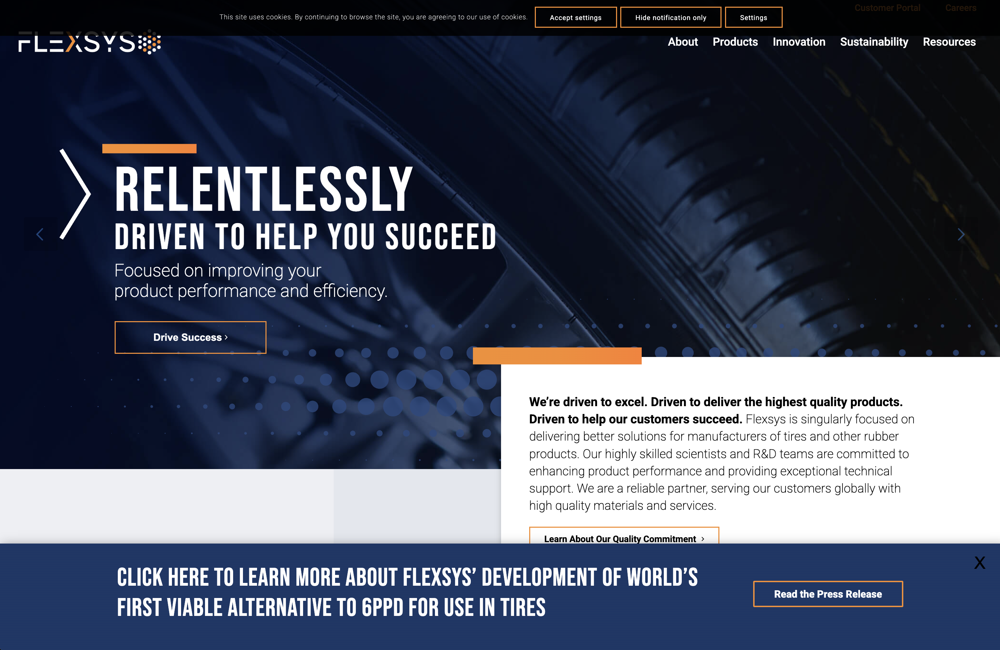

**URL:** https://flexsys.com/ 

**Testing URL:** https://test-flexsys.pantheonsite.io/  
un: flexsys 
pw: flexsys

**Development URL:** https://dev-flexsys.pantheonsite.io/  
un: flexsys  
pw: flexsys

**History + Status:** Site built by Pepper Group in 2021 by Joe Whittington. Site receives ongoing monthly maintenance from Pepper Group, with occasional requests to add content or functionality. Site is additionally secured by the Sharkgate firewall on CloudFlare as implemented by third party OneHourSiteFix to rate limit malicious attacks. 

**Hosting:** <a href="https://dashboard.pantheon.io/workspace/369dec37-483d-464d-bda6-0046361ce900/cms-site/6e263394-0ebf-4050-994f-8d848ae4194a/environment/dev/code" target="_blank" rel="noopener">Pantheon</a>

**Contacts**
- PG Accounts: Stacy Tanzler stacy@peppergroup.com 
- PG Tech Lead: erica dreisbach erica@peppergroup.com
- PG Tech Backup: Joseph Whittington joseph@peppergroup.com 

**Analytics** 
- <a href="https://analytics.google.com/analytics/web/#/a211294137p347641980/reports/explorer?params=_u..nav%3Dmaui%26_u.dateOption%3DyearToDate&collectionId=11080460104&r=all-pages-and-screens&ruid=99e2c496-b8be-430d-a3de-3fa1780a7179" target="_blank" rel="noopener">Google Analytics</a>
- <a href="https://tagmanager.google.com/#/container/accounts/6005171966/containers/53689499/workspaces/4" target="_blank " rel="noopener">Google Tag Manager</a>
- <a href="https://search.google.com/search-console?resource_id=https%3A%2F%2Fflexsys.com%2F" target="_blank" rel="noopener">Google Search Console</a>

**Security** 
- <a href="https://my.pingdom.com/app/reports/uptime#check=12897214" target="_blank" rel="noopener">Pingdom</a> - site uptime monitoring
- <a href="https://dash.cloudflare.com" target="_blank" rel="noopener">CloudFlare</a> - 2FA login linked to stacy@peppergroup.com 

**Internal Project Assets**
- Egnyte - [??]
- Asana - [??] 

**Repositories**
- Pantheon `ssh://codeserver.dev.6e263394-0ebf-4050-994f-8d848ae4194a@codeserver.dev.6e263394-0ebf-4050-994f-8d848ae4194a.drush.in:2222/~/repository.git` 
- Github `git@github.com:PepperGroup/flexsys.git`

**Tech Stack Notes** 
- Uses Ultimate Member to manage client access to proprietary PDFs

**Recurring Tasks**
- Monthly WordPress site maintenance (plugin updates, tech stack checks, SEO checks)

**Known Issues / Tech Debt**
- In early 2024, client was keen on gahering analytics on the specific PDFs accessed by specific logged-in users. PDFs are hosted on HubSpot, but current HubSpot analytics does not connect PDF downloads to WordPress logins. If this issue is picked baack up, one path forward could be to replace existing PDF buttons (outbound links to HubSpot PDFs) with an ultra-simple HubSpot form using hidden fields to capture username and PDF title. These &ldquo;forms&rdquo; could be built to appear strictly as "DOWNLOAD" buttons, and wdditional configuration to dynamically redirect the user to the desired HubSpot PDF on click. 
- In December 2025 during routine Flexsys maintenance, the Activity Log showed that on November 20th, 2025 there were 4k+ failed logins with username “John.” The Solid Security Basic plugin and SharkGate firewall rate limits failed logins by IP address, but apparently not by username. If bad actors persist, the Limit Logins plugin could be a viable solution without interfering with typical user experience: 
https://wordpress.org/plugins/limit-login-attempts-reloaded/
- Before adding another plugin, as a lower-vulnerability solution a tarpit for the username &ldquo;John&rdquo; was added to `functions.php` - `tarpit_banned_username()`

**Quirks + Important Context** 
- Site has been particularly targeted by malicious attacks, including spam account creation by variations on &ldquo;Tony Stark&rdquo; in September 2023, a Trojan Horse exploit of the Ultimate Member plugin in October 2023, and spam registrations with the username &ldquo;John&rdquo; December 2025. 
- See root cause report on the October 2023 attack: 
https://peppergroup.egnyte.com/dl/v9wvxdTM3tbm/Root_Cause_Analysis_-_Flexsys_Site_Compromise_-_October_2023.docx_
- See CloudFlare instructions

# JO / Japs-Olson 

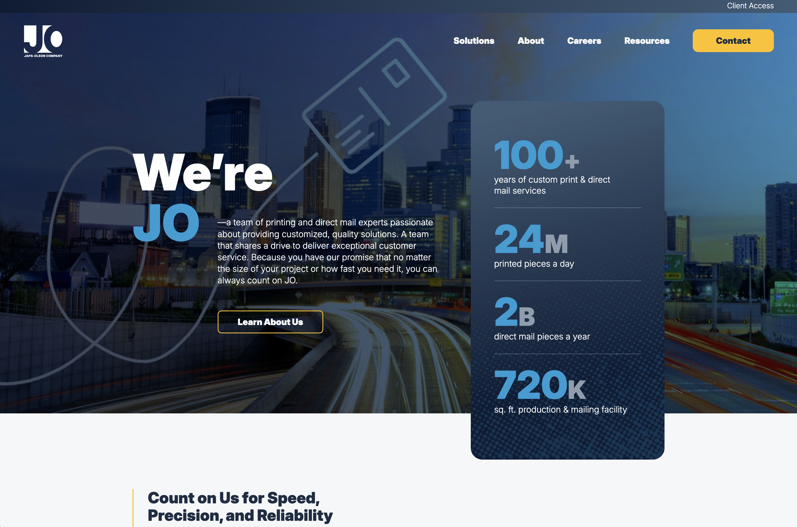

**URL:** https://japsolson.com/

**History + Status:** Site launched in January 2025, child theme of Enfold, built by erica dreisbach. Site as-is was originally intended as a microsite before a round of more comprehensive development. Running well and working well. Client is variously referred to as &ldquo;Japs-Olson&rdquo; and &ldquo;JO.&rdquo;

**Hosting:** WP Engine https://my.wpengine.com/installs/joprintmailers

**DNS:** Client has access

**Analytics**
- <a href="https://analytics.google.com/analytics/web/#/a338209394p469359299/reports/intelligenthome" target="_blank" rel="noopener">Google Analytics</a>

**Contacts**
- Client: Karen Danielson kdaniels@japsolson.com
- Client Tech Contact: Gene Grueschow ggruesch@japsolson.com
- PG Accounts: Grace Rodi grace@peppergroup.com
- PG Tech Lead: erica dreisbach erica@peppergroup.com 
- PG Tech Backup: McCade Freeman mccade@peppergroup.com
- PG Design Lead: Joe Whittington joseph@peppergroup.com 

**Internal Project Assets**
- Egnyte https://peppergroup.egnyte.com/fl/FGDgdffYhvTK/24-JO-4991_Microsite_
- Asana https://app.asana.com/1/1166973237627545/project/1208024637920788/task/1208106240670126

**Repositories**
- Production `git@git.wpengine.com:joprintmailers.git`
- Github `github.com:PepperGroup/jolson.git`

**Tech Stack Notes** 
- Site eyebrow nav links to third-party proof approval and mail tracking logins for JO clients 
- Forms built with HubSpot

**Recurring Tasks**
- N/A

**Known Issues / Tech Debt**
-  Resources top-nav link is empty

**Quirks + Important Context** 
-  Site as-is was originally intended as a microsite before a round of more comprehensive development.

# Kensing Solutions 

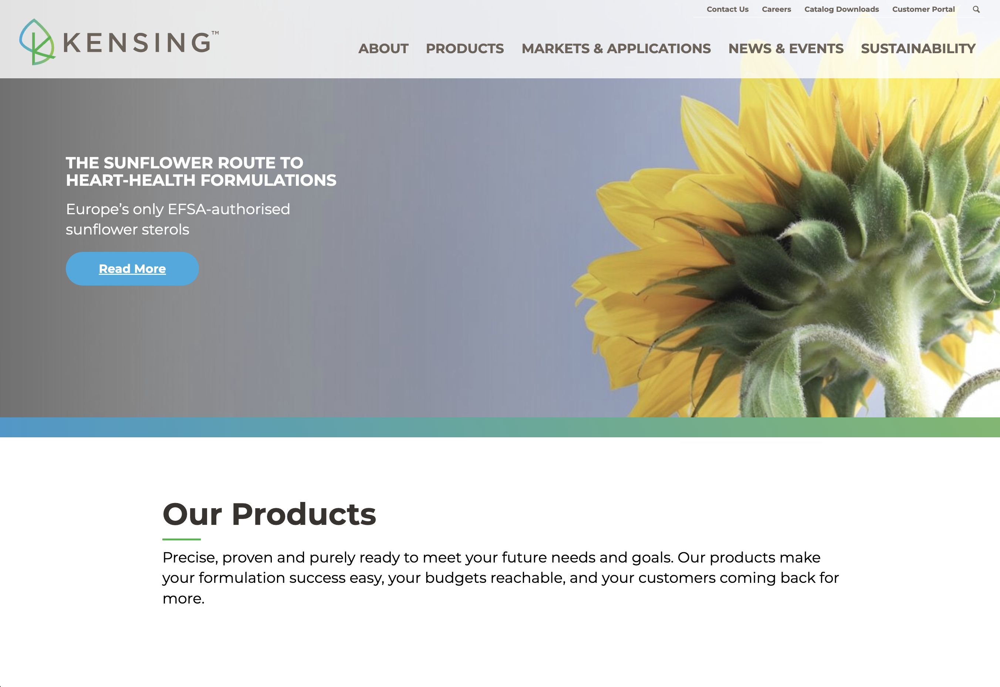

**URL:** https://kensingsolutions.com/ 

**Test URL:** https://test-kensing-com.pantheonsite.io/ 
un: kensing
pw: kensing

**Development URL:** https://dev-kensing-com.pantheonsite.io/
un: kensing
pw: kensing

**History + Status:** Site built [??]. 

**Hosting:** Pantheon 

**DNS:** [??}

**Analytics**
- Google Analytics https://analytics.google.com/analytics/web/#/a193582090p347642779/reports/explorer?params=_u..nav%3Dmaui%26_u.dateOption%3DyearToDate&collectionId=11080460104&r=all-pages-and-screens&ruid=99e2c496-b8be-430d-a3de-3fa1780a7179
- Google Tag Manager https://tagmanager.google.com/#/container/accounts/6004307023/containers/47947917/workspaces/5
- Google Search Console https://search.google.com/search-console?resource_id=https%3A%2F%2Fkensingsolutions.com%2F

**Contacts**
- Client: Eva Criado eva.criado@kensingsolutions.com
- PG Accounts: Eliza Uhland eliza@peppergroup.com 
- PG Tech Lead: McCade Freeman mccade@pappergroup.com 

**Repositories**
- Pantheon  ssh://codeserver.dev.6bca8971-d76a-4cf4-82f3-ed209d138943@codeserver.dev.6bca8971-d76a-4cf4-82f3-ed209d138943.drush.in:2222/~/repository.git
- Github git@github.com:PepperGroup/kensing.git

**Tech Stack Notes** 
- Uses Essential Grid to power News and Events page https://kensingsolutions.com/about/news-and-events/ 
- Uses Ultimate Member to manage Customer Portal registrations and access to proprietary content
- Significant mainland China userbase prevents use of Google reCAPTCHA to secure forms; MT Captcha used instead and connected to Ultimate Member via custom plugin 

**Recurring Tasks**
- Monthly WordPress site maintenance (plugin updates, tech stack checks, SEO checks)
- Maintenance report includes a screenshot of 30 days of login activity from the MT Captcha dashboard

**Known Issues / Tech Debt**
- Client has a significant user base in mainland China, where Google reCAPTCHA is banned. MT Captcha was added in November 2024 to secure Member Portal content WordPress back end, and hacked onto the Ultimate Member plugin with a combination of the  **Theme My Login** plugin (secures admin and customer login forms) and a fork from the **MT Captcha** plugin (secures the Ultimate Member registration form). Periodic manual review of custom code involved is strongly advised. 
- Thank You page is included in `sitemap.xml`; adjust settings in Yoast to hide from search and avoid polluting conversion analytics data with inadvertant bot or user traffic 
- Navigation font is incorrect on portal pages (Barlow Condensed instead of correct Montserrat) 
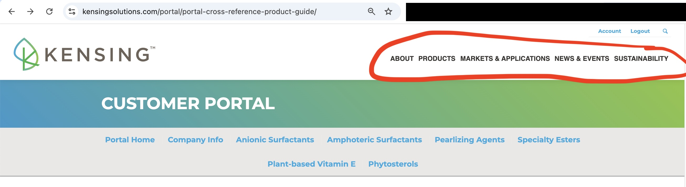

**Quirks + Important Context** 
- Since [?? ... Vitae Naturals acquisition ?? ] Kensing's overseas team has managed major content updates 
- As of late 2025, Ultimate Member seems to no longer allow email addresses using `+` for uniqueness; Adjusting or updating the `websites+subscriber@peppergroup.com` Subscriber account used for testing can still be done with use of command line mySql access

# Permatron

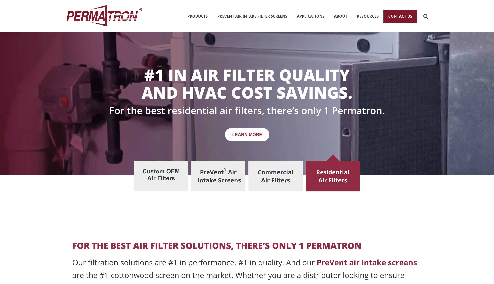

**URL:** https://permatron.com/

**Testing URL:** https://test-permatron-refactor.pantheonsite.io/

**Development URL:** https://dev-permatron-refactor.pantheonsite.io/

**History + Status:** Site originally built circa 2011 (!) using JupiterX and WPBakery. Significant efforts in July 2024 to modernize the build for compatibility with PHP version 8+ 

**Hosting:** <a href="https://dashboard.pantheon.io/workspace/369dec37-483d-464d-bda6-0046361ce900/cms-site/254fc6d8-11bc-4e16-8b82-0f685c20bd8c/environment/dev/code" target="_blank" rel="noopener">Pantheon</a>

**DNS:** [??]

**Analytics**
- <a href="https://analytics.google.com/analytics/web/#/a12469867p300282809/reports/explorer?params=_u..nav%3Dmaui%26_u.dateOption%3DyearToDate&collectionId=11080460104&r=all-pages-and-screens&ruid=99e2c496-b8be-430d-a3de-3fa1780a7179" target="_blank" rel="noopener">Google Analytics</a>
- <a href="https://tagmanager.google.com/#/container/accounts/6002235395/containers/33036377/workspaces/39" target="_blank" rel="noopener">Google Tag Manager</a>
- <a href="https://search.google.com/search-console?resource_id=https%3A%2F%2Fpermatron.com%2F" target="_blank" rel="noopener">Google Search Console</a>

**Contacts**
- Client: Gayle Matthies Gayle Matthies <GMatthies@rensafiltration.com> 
- PG Accounts: Stacy Tanzler stacy@peppergroup.com
- PG Tech Lead: Todd Underwood todd@peppergroup.com 
- PG Tech Backup: erica dreisbach erica@peppergroup.com

**Repositories**
- Pantheon `ssh://codeserver.dev.254fc6d8-11bc-4e16-8b82-0f685c20bd8c@codeserver.dev.254fc6d8-11bc-4e16-8b82-0f685c20bd8c.drush.in:2222/~/repository.git`

**Tech Stack Notes** 
- Site uses JupiterX child theme with WPBakery Page Builder
- Forms built with HubSpot

**Recurring Tasks**
- Monthly WordPress site maintenance (plugin updates, tech stack checks, SEO checks)

**Known Issues / Tech Debt**
- Significant &ldquo;unknown unknowns&rdquo; due to the sheer amount of legacy content and tech; Notably, this is one of PG's most-visited sites, averaging 7k-10k views per month

**Quirks + Important Context** 
- Content dates back to 2011 https://permatron.com/prevent-installs/new-animated-cartoon-starring-prevent-air-intake-filters 

# Robertshaw

**URL:** https://www.robertshaw.com/

**Staging URL:** https://robertshawstg.wpenginepowered.com/ 

**Development URL:** https://robertshawstg.wpenginepowered.com/ 

**History + Status:** High-traffic large-footprint WordPress site launched March 2025. Enfold child theme built by erica dreisbach. Support for Find a Distributor and Competitor Cross-Reference tools from Brian Royer. 

**Hosting:** WP Engine - https://my.wpengine.com/installs/robertshaw1 

**DNS:** CSC Corporate Domains - client has access

**Analytics**
- <a href="https://analytics.google.com/analytics/web/#/a672847p353013416/reports/explorer?params=_u..nav%3Dmaui%26_u.dateOption%3DyearToDate&collectionId=11080460104&r=all-pages-and-screens&ruid=99e2c496-b8be-430d-a3de-3fa1780a7179" target="_blank" rel="noopener">Google Analytics</a>
- <a href="https://tagmanager.google.com/#/container/accounts/4243101562/containers/10076276/workspaces/94" target="_blank" rel="noopern">Google Tag Manager</a> **NOTE:** Use Robertshaw container, *not* Robertshaw 2025
- <a href="https://search.google.com/search-console?resource_id=https%3A%2F%2Fwww.robertshaw.com%2F" target="_blank" rel="noopener">Google Search Console</a>

**Contacts**
- Client: Katie Kretschmar katie.kretschmar@robertshaw.com
- Client Technical Contact: Octavio Gomez octavio.gomez@robertshaw.com
- PG Accounts: Grace Rodi grace@peppergroup.com 
- PG Tech Lead: erica dreisbach erica@peppergroup.com 
- Additional Tech: Brian Royer brian@soundwebmedia.com 
- PG Tech Backup: McCade Freeman mccade@peppergroup.com 
- PG Design Lead: Brian Erickson brian@peppergroup.com 

**Internal Project Assets**
- Egnyte https://peppergroup.egnyte.com/app/index.do#storage/files/1/Shared/Documents/Clients%20-%20Active/ROBERTSHAW/24-Robertshaw-4965_Website
- Asana https://app.asana.com/1/1166973237627545/project/1207718594991922/list/1207718948383558

**Repositories**
- Production git@git.wpengine.com:robertshaw1.git
- Staging git@git.wpengine.com:robertshawstg.git
- Development git@git.wpengine.com:robertshawdev.git
- Github git@github.com:PepperGroup/robertshaw.git

**Tech Stack Notes** 
- The main contact form is an HTML widget connected directly to client's SalesForce CRM
- Landing pages use HubSpot forms secured with a HubSpot Google reCAPTCHA 
- Landing page for China uses an HTML HubSpot form secured with hCAPTCHA 
- Document Library uses the FacetWP plugin 

**Recurring Tasks**
- Monthly WordPress site maintenance (plugin updates, tech stack checks, SEO checks)

**Known Issues / Tech Debt**
- Main contact form does not properly validate reCAPTCHA responses https://robertshaw.com/contact https://www.google.com/recaptcha/admin/site/720940655 

**Quirks + Important Context** 
- Find a Distributor https://www.robertshaw.com/distributor-locator/ and Competitor Cross-Reference https://www.robertshaw.com/competitor-cross-reference/ are updated via Google Sheets accessible in the WordPress back end when logged in to Google as pepperanalytics@gmail.com 

# Schebler Spec Fab

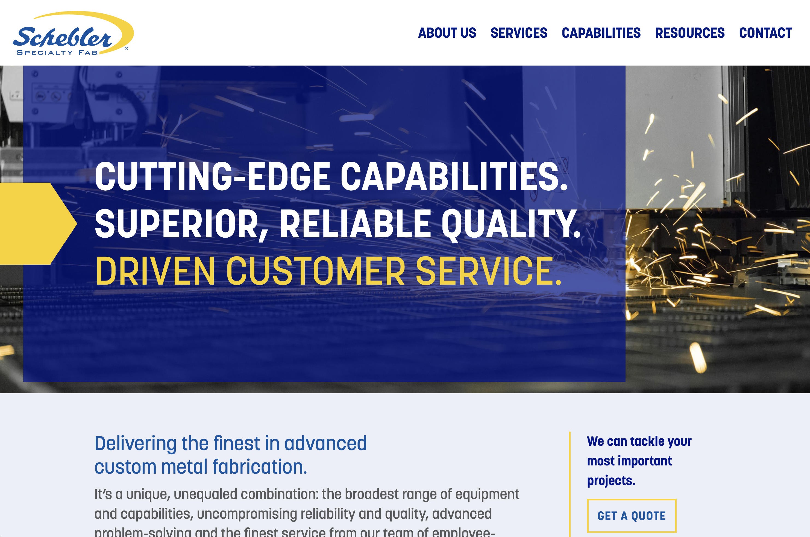

**URL:** https://scheblerspecfab.com/

**Development URL:** https://staging.scheblerspecfab.com/ 

**History + Status:** 
Site inherited from a third-party build (Valve and Meter??) using a Gutenberg / Timber theme. Significant efforts in January 2026 to bring style in-line with Enfold builds created by Pepper Group on https://schebler.com/ and https://scheblerchimney.com/. 

**Hosting:** <a href="https://209.59.154.39:2083" target="_blank" rel="noopener">cPanel</a>
 
**DNS:** <a href="https://dcc.godaddy.com/control/portfolio/scheblerspecfab.com/settings" target="_blank" rel="noopener">GoDaddy</a> - Delegate Access under Lance McDanel

**Analytics**
- <a href="https://analytics.google.com/analytics/web/#/a352719994p486326322/reports/explorer?params=_u..nav%3Dmaui%26_u.dateOption%3DyearToDate&collectionId=11080460104&r=all-pages-and-screens&ruid=99e2c496-b8be-430d-a3de-3fa1780a7179" target="_blank" rel="noopener">Google Analytics</a>
- <a href="https://tagmanager.google.com/#/container/accounts/6290964144/containers/217728363/workspaces/4" target="_blank" rel="noopener">Google Tag Manager</a>
- <a href="https://search.google.com/search-console?resource_id=https%3A%2F%2Fscheblerspecfab.com%2F" target="_blank" rel="noopener">Google Search Console</a>

**Contacts**
- Client: Matt Anderson manderson@schebler.com 
- Legacy 3rd Party Tech: Nathan Allan https://valveandmeter.com/
- PG Accounts: Mahek Lakhani mahek@peppergroup.com 
- PG Tech Lead: Todd Underwood todd@peppergroup.com 
- PG Tech Backup: Joe Whittington joseph@peppergroup.com 

**Repositories** 
- **NOTE** Git version control is on `/framework` theme only
- Production - `scheblerspecfab:www/wp-content/themes/framework.git`
- Staging - `scheblerspecfab:staging.scheblerspecfab.com/wp-content/themes/framework.git`
- Github - `git@github.com:PepperGroup/schebelerspecfab-theme.git`

**Tech Stack Notes** 
- Resource Library and Articles & Insights pages powered by Essential Grid 
- Forms use Gravity Forms

**Recurring Tasks**
- Monthly WordPress site maintenance (plugin updates, tech stack checks, SEO checks)

**Known Issues / Tech Debt**
- Hard-coded homepage template (??) in `/homepage-2025.php` 
- Orphaned CSS files ... integrate with `/assets/css/theme.css` ?
    - `/assets/css/homepage-2025.css`  
    - `/assets/css/contact.css`

**Quirks + Important Context** 
- Inherited build using Gutenberg / Timber; Significant efforts to bring design in line with Schebler Chimney and Schebler corporate sites in January 2026

# Sensience 

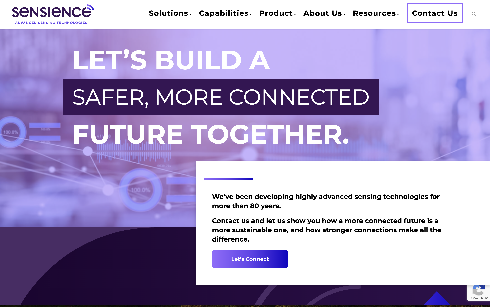

**URL:** https://www.sensience.com/ 

**Testing URL:** https://test-sensience.pantheonsite.io/ 

**Development URL:** https://dev-sensience.pantheonsite.io/ 

**History + Status:** 

**Hosting:** Pantheon - https://dashboard.pantheon.io/workspace/369dec37-483d-464d-bda6-0046361ce900/cms-site/624b3c2b-7151-48e4-bd52-f1f9555eff5c

**DNS:** [??]

**Analytics**
- <a href="https://analytics.google.com/analytics/web/#/a252586185p347232863/reports/explorer?params=_u..nav%3Dmaui%26_u.dateOption%3DyearToDate&collectionId=11080460104&r=all-pages-and-screens&ruid=99e2c496-b8be-430d-a3de-3fa1780a7179" target="_blank" rel="noopener">Google Analytics<a>
- <a href="https://tagmanager.google.com/#/container/accounts/6066928534/containers/99173694/workspaces/2" target="_blank" rel="noopener">Google Tag Manager</a>
- <a href="https://search.google.com/search-console?resource_id=https%3A%2F%2Fwww.sensience.com%2F" target="_blank" rel="noopener">Google Search Console</a>

**Contacts**
- Client: Todd Wilson Todd.Wilson@sensience.com
- Client Technical Contact: Roland Good Roland.Good@sensience.com
- PG Accounts: Mahek Lakhani mahek@peppergroup.com 
- PG Tech Lead: erica dreisbach erica@peppergroup.com
- PG Tech Backup: Joe Whittington joseph@peppergroup.com 
- PG Design Lead: Joe Whittington joseph@peppergroup.com
- Third Party Technical Contact (CRM): Brian Segers bsegers@techosystems.com

**Repositories**
- Pantheon `ssh://codeserver.dev.624b3c2b-7151-48e4-bd52-f1f9555eff5c@codeserver.dev.624b3c2b-7151-48e4-bd52-f1f9555eff5c.drush.in:2222/~/repository.git`
- Github `git@github.com:PepperGroup/sensience.git`

**Tech Stack Notes** 
- Makes use of Enfold Hotspot modul for Locations page
- Leadership, Resources page, Product category pages use Essential Grid
- Forms built with Gravity Forms

**Recurring Tasks**
- Monthly WordPress site maintenance (plugin updates, tech stack checks, SEO checks)

**Known Issues / Tech Debt**
- Site uses the Enfold-packaged cookie notice, including preference settings for Google fonts, but these settings are not actually connected to front end tech and thuis cookie notice would not hold up to legal or technical scrutiny 

**Quirks + Important Context** 
- Resource post type uses Essential Grid meta field to point to PDFs hosted on HubSpot. In November 2023 the Resource post type was removed from native search results; Asana task: https://app.asana.com/1/1166973237627545/project/1166973102232817/task/1205887049212848?focus=true
- Cloned content on Contact page and Request a Quote page  https://www.sensience.com/get-a-quote/
- Client has reported repeatedly unexpected log out from back end; cf Asana task August 2024: https://app.asana.com/1/1166973237627545/project/1166973102232817/task/1208153640697190?focus=true This was most likely a browser issue on the client's end, but root cause remains unknown
- In September 2025 site contact forms transitioned to Gravity Forms connected to client's Creatio CRM; Asana task: https://app.asana.com/1/1166973237627545/project/1166973102232817/task/1211360751767119?focus=true 

----------

# Legacy Projects 

## ArchKey Solutions

## PCBS

## PharmaLogistics 

## RTMec

https://my.wpengine.com/installs/rtmengineering

## TIGRIS

